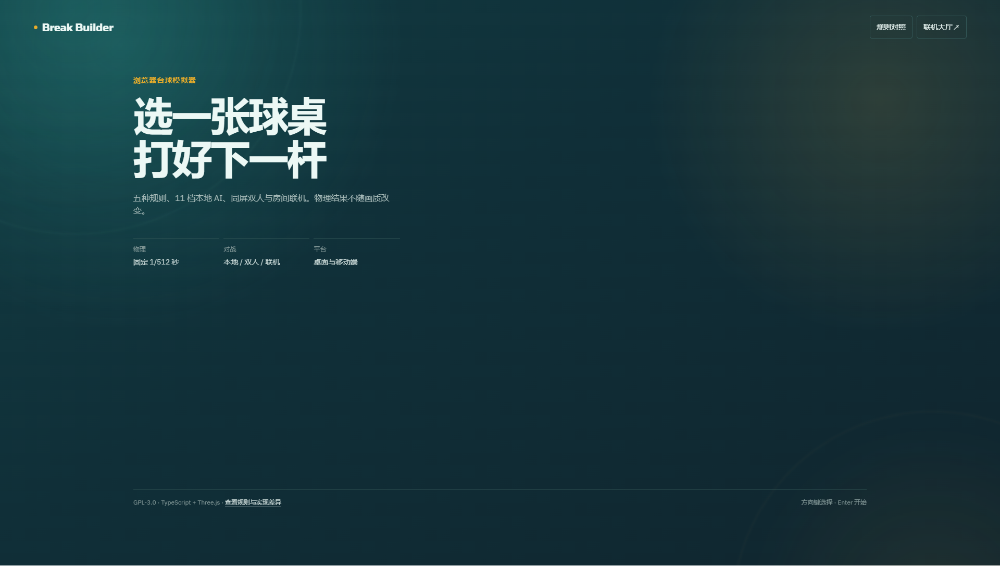
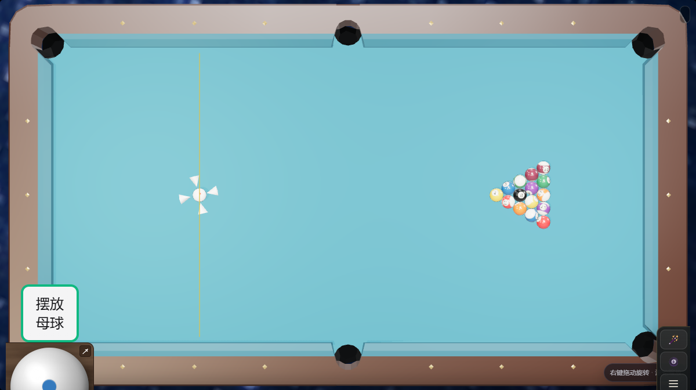

# Break Builder 3D

> 在浏览器里还原击球、走位与解球，而不只是让球“看起来会滚”。

[](https://github.com/liburce0412-alt/billiards/actions/workflows/main.yml)
[](LICENSE)
[](https://www.typescriptlang.org/)
[](https://threejs.org/)

Break Builder 3D 是一个基于 TypeScript、Three.js 和自研台球物理内核的开源浏览器
台球项目。它支持中式八球、美式九球、四球追分、斯诺克和三库，并提供练习、11 档
本地 AI、同屏双人、在线房间、录像与回放。

[在线试玩](https://liburce3d-billiards.sharp-heron-2601.chatgpt.site/) ·
[规则对照](https://liburce3d-billiards.sharp-heron-2601.chatgpt.site/rules.html) ·
[提交问题](https://github.com/liburce0412-alt/billiards/issues)

| 首页 | 高画质对局 |
| --- | --- |
|  |  |

## 核心能力

- **稳定物理**：使用固定 `1/512 s` 物理步长和时间累加器；画质与显示帧率不改变比赛结果。
- **五套规则**：通过版本化 `RuleProfile` 和共享判定层实现中八、九球、四球追分、斯诺克和三库。
- **11 档 AI**：AI 在 Web Worker 中调用正式物理内核试打，评估进球、犯规、母球落点、下一杆、安全球和解球。
- **可自由观察**：玩家击球后和 AI 思考/击球时均可旋转、俯仰、缩放，不再强制在 2D 与 3D 间闪切。
- **分档渲染**：`low`、`balanced`、`high` 三档画质，包含 PBR 球体、真实阴影、台呢微法线和移动端降级。
- **个性化外观**：可选择球杆前节、前把纹理、握把、环饰、镶嵌、球台样式及银河、星云、俱乐部环境。
- **有层次的声音**：击球、球撞球、碰库与落袋均有多采样音频池；AI 和玩家共用同一音效链。
- **本地与在线对战**：支持同屏轮流击球和双浏览器在线房间，带事件去重、重连提示及局面恢复。

## 玩法与规则

| 玩法 | 当前实现基线 | 特色 |
| --- | --- | --- |
| 中式八球 | 中式台球协会公开规则基线 | 开球后开放球组、混合传球不分组、线后自由球 |
| 美式九球 | WPA 9-Ball | 必须先碰最低号球、合法开球、组合球与轮转 |
| 四球追分 | 项目 1/4/7/10 规则集 | 目标顺序与 1/4/7/10 得分、小金/大金、传九、让杆 |
| 斯诺克 | WPBSA 基线 | 红彩交替、彩球复位、犯规罚分与清彩 |
| 三库 | UMB 基线 | 母球碰第二目标球前至少三次碰库 |

规则来源、版本、复核日期和项目差异均列在
[规则对照页](https://liburce3d-billiards.sharp-heron-2601.chatgpt.site/rules.html)。
规则情景库目前覆盖 208 个可序列化固定场景，人类、AI、本地双人和在线模式共用同一
判定入口。

## 11 档 AI

AI 不依赖云端模型，完全在浏览器本地运行。每次规划会生成合法目标、袋口、力量、杆法、解球、安全球与自由球摆位候选，再用 `1/512 s` 的正式物理配置试打。

| 档位 | 定位 | 主要差异 |
| --- | --- | --- |
| 1–3 | 入门到熟练爱好者 | 较大的瞄准和力量误差，搜索候选较少 |
| 4–5 | 偶尔清台到稳定进球 | 开始考虑下一杆和简单走位 |
| 6–8 | 县级强手到高水平选手 | 常规球准度接近，主要比较走位、解球和安全球 |
| 9–11 | 顶尖本地 AI | 更深候选预算与两层线路评估，但困难球仍保留非零误差 |

各档固定候选预算为 `3 / 4 / 6 / 8 / 10 / 14 / 18 / 24 / 30 / 40 / 48`。
相同局面、档位和输入会产生可重复的选择；Worker 不可用时会回退到几何规划，不会
故意直打障碍球。

## 操作

| 操作 | 鼠标 / 键盘 |
| --- | --- |
| 调整击球方向 | 移动鼠标或使用瞄准控制 |
| 环绕观察 | 按住鼠标右键拖动 |
| 缩放视角 | 鼠标滚轮 |
| 调整俯仰 | 局内视角控制或环绕拖动 |
| 调整击球点 / 杆法 | 点击母球击球点面板 |
| 蓄力与击球 | 底部力度条 |
| 自由球摆位 | 拖动母球；确认前可反复调整 |
| 打开设置 | 右下角菜单按钮 |

第一次进入比赛会显示一次操作提示。设置抽屉中可以调整视角、音量、画质、球杆、球台与环境。

## 快速开始

### 环境要求

- Node.js 22 或更高版本
- Corepack
- 支持 WebGL 2 的现代浏览器

### 本地运行

```bash
git clone https://github.com/liburce0412-alt/billiards.git
cd billiards
corepack enable
yarn install --immutable
yarn serve
```

打开 <http://localhost:8080/>。开发服务器会监听源码变化并自动重新构建。

### 常用 URL 参数

| 参数 | 示例 | 说明 |
| --- | --- | --- |
| `ruletype` | `eightball`、`nineball`、`fourball`、`snooker`、`threecushion` | 玩法 |
| `quality` | `low`、`balanced`、`high` | 渲染质量，优先级高于旧 `lod` |
| `bot` | `TheFarJaw` | 开启本地 AI |
| `botLevel` | `1`–`11` | AI 档位 |
| `practice` | `true` / `false` | 练习模式 |
| `environment` | `galaxy`、`nebula`、`club` | 场景环境 |

示例：[高画质八球 AI 对局](https://liburce3d-billiards.sharp-heron-2601.chatgpt.site/?play=1&ruletype=eightball&quality=high&bot=TheFarJaw&botLevel=8&practice=false)。

## 开发命令

| 命令 | 用途 |
| --- | --- |
| `yarn serve` | 启动开发构建和本地静态服务器 |
| `yarn build` | 生成生产构建并准备 Sites 发布包 |
| `yarn test` | 运行 Jest 单元与情景测试 |
| `yarn coverage` | 生成覆盖率报告 |
| `yarn lint` | TypeScript 类型检查与 ESLint |
| `yarn lint:css` | 检查 HTML/CSS |
| `yarn test:e2e` | 运行 Playwright 视觉与浏览器测试 |
| `RUN_ONLINE_E2E=1 yarn test:e2e e2e/online.spec.ts` | 使用两个浏览器上下文验证在线房间 |

当前回归基线为 **96 个 Jest 套件、725 项测试**。Playwright 覆盖 `360×800`、
`768×1024`、`1200×750`、`1920×1080` 四种视口，并保留低/高画质固定截图。

## 项目结构

```text
.
├─ src/
│  ├─ controller/       # 比赛流程、规则、AI 与输入
│  ├─ model/            # 球、球桌、碰撞与固定步长物理
│  ├─ view/             # Three.js 场景、材质、相机和 UI
│  └─ worker/           # AI 无界面试打与规划
├─ dist/                # 浏览器入口、样式、模型、纹理与音频资源
├─ test/                # Jest 单元、规则情景和确定性测试
├─ e2e/                 # Playwright 多视口、截图和在线对战测试
├─ scripts/             # 构建与 Sites 发布准备
└─ docs/                # 架构与测试说明
```

更多细节见[架构说明](docs/ARCHITECTURE.md)和[测试指南](docs/TESTING.md)。

## 资源与许可证

- 源代码按 [GNU GPL-3.0](LICENSE) 发布。
- 新增模型与程序化资产的说明见 [`dist/models/MODEL_ASSETS.md`](dist/models/MODEL_ASSETS.md)。
- 音频来源、处理方式与许可证见 [`dist/sounds/LICENSES.md`](dist/sounds/LICENSES.md)。
- 项目基于 [tailuge/billiards](https://github.com/tailuge/billiards) 持续开发，保留原作者及贡献者署名。

提交代码前请阅读[贡献指南](.github/CONTRIBUTING.md)。安全问题请按[安全策略](SECURITY.md)中的非公开方式报告。

## 路线图

- 扩展规则情景库与赛事规则版本跟踪
- 提升高档 AI 的多杆走位、安全球和复杂解球
- 完善在线房间的断线恢复与移动端网络测试
- 持续校准球、库边、袋口和台呢参数
- 增加更多轻量球杆、球台和环境组合

---

如果你关心台球物理、规则、AI 走位或 WebGL 表现，欢迎发起 Issue 或 Pull Request。
