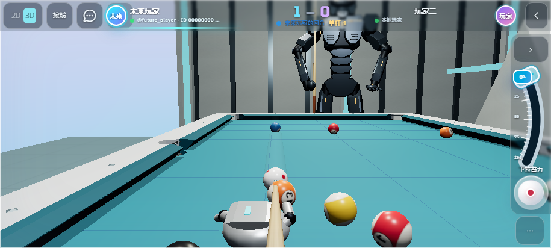
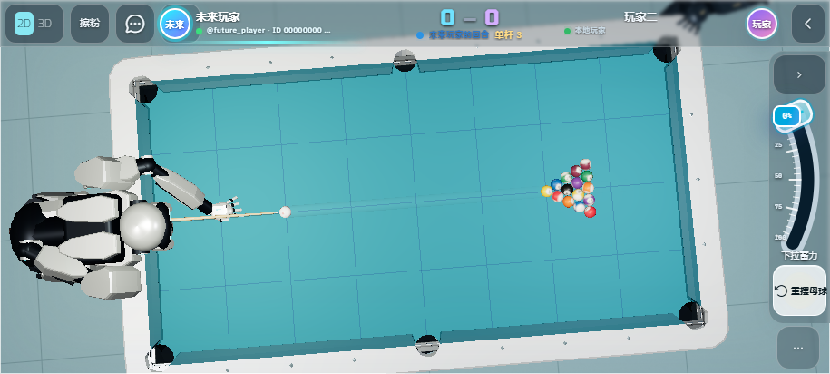

# 移动端回合视角与遮挡修复

2026-09-05 20:42（Asia/Shanghai）已部署到 https://play.campus3ai.xyz/ 。

- 修复击球后记录条被内联 `display: flex` 重新打开的问题。记录放入顶部原生折叠入口，包含奖杯和回放链接；产生新记录不会自动展开。支持点空白和 Escape 收起。
- 球杆仰角按钮移入“更多操作”，不再从右侧突出；仰角调节与单指视角俯仰继续可用。
- 移动端每次进入 Aim 回合，将自由观察或调整后的 3D 视角恢复为默认母球后方视角，并沿规则选出的合法目标球方向瞄准；显式选择 2D 时继续保留俯视。桌面自由观察偏好保持原有行为。
- 3D 击球视角跟随当前母球位置，不改写已记录的击球位置；双指自由观察从母球周围开始。

## 验证

807 个 Jest 用例（113 个套件）、11 项移动和页面 Playwright 检查、TypeScript / ESLint、CSS lint、Prettier、生产构建、资源来源检查通过。

触控流程实际连续击打两杆，每杆先双指改变观察角度，再验证新回合恢复为 Aim 镜头。两杆后记录仍收在顶部，打开入口能查看记录；“更多操作”中的仰角按钮可打开调节器并加一度。取景截图等待镜头回到母球后方，而非截取回位过程。

截图来自本地浏览器模拟触控，使用演示玩家数据；实体手机手感仍待实机验收。

## 发布

- 构建版本：`260905.20`。
- Worker 版本：`5dd44d58-9af3-4888-80ba-6886ce11a719`。
- 部署：`f0dcb077-4418-443f-8068-f55f73fc462a`，100% 生产流量。
- 66 个线上资源 SHA-256 与本地发布包一致，六类页面入口返回 200，匿名账户接口返回预期 401。
- [逐文件校验](release-verification.json)。
