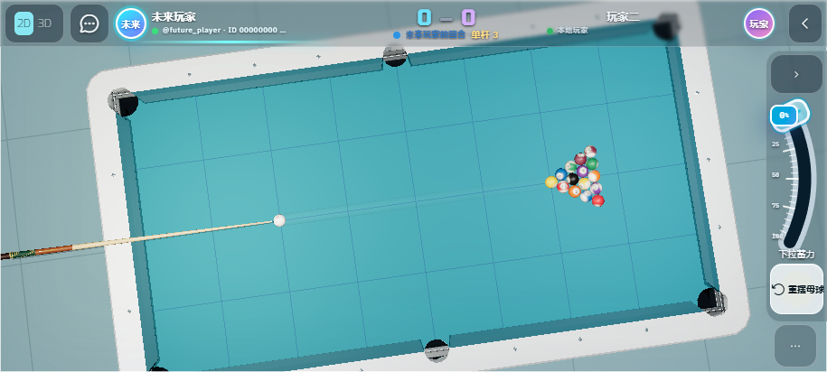

# 移动操作修复与生产部署

根据用户两张手机实机截图修复，2026-09-05 16:38（Asia/Shanghai）部署。

- 左上角无效菜单替换为常驻 2D / 3D 切换及局内消息入口，恢复顶部按钮点击响应。
- 移动端隐藏悬浮进球记录条，单杆数融合进比分栏；消息内容仅主动展开时显示。
- 3D 画布覆盖整个屏幕，背景延伸到右侧操作区。顶部和右侧使用低遮挡透明背景，移除独立装饰渲染层；右侧缩窄为 68px 加安全区域。
- 单指横拖瞄准、上下调整视角俯仰；双指环绕与捏合缩放继续保留。相机触摸按钮在画布拖动后也能立即响应。
- 击球后输入框与读数归零，下一瞄准回合清除上一杆力度；已击出的球及回放记录保留原始力度。

## 验证

- 113 个 Jest 测试套件、805 个用例通过。
- 15 项 Playwright 页面及触控检查通过，包含 568×320 小横屏、单双指操作、2D / 3D 切换及连续两杆触控出杆归零。
- TypeScript、ESLint、CSS lint、Prettier、webpack 生产构建及资源来源审计通过。
- 66 个线上 HTML、JS、CSS 和环境图片逐个 SHA-256 与本地发布包一致；六类页面入口返回 200，匿名账户接口返回预期 401。

版本：`260905.16`。Worker 版本：`6ff21696-dbb2-4083-8271-0620f2097c25`，部署 ID：`e4b5c916-1565-4a34-b01b-b82470099d7e`，生产流量 100%。

[线上校验明细](release-verification.json) · [正式网站](https://play.campus3ai.xyz/)

截图为本地模拟玩家及单杆展示数据。触控检查使用浏览器输入事件完成，尚未代替实体手机的 GPU 性能、浏览器兼容性与手感验收。
