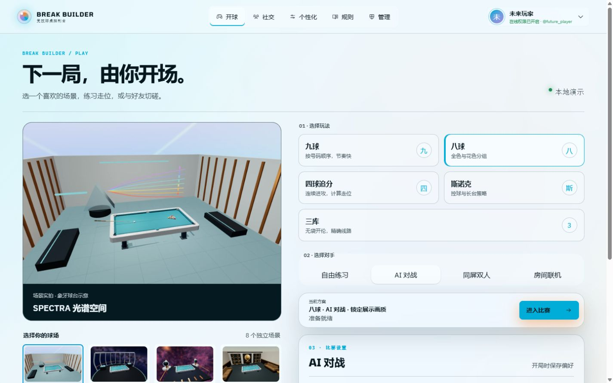

# 页面 UI 与环境联动 · 2026-09-05

本轮覆盖首页/开局配置、账户、大厅、管理、规则和帮助入口。所有截图来自本地浏览器，页面中的玩家和管理数据为本地演示数据。

## 变化

- 首页用八套游戏实景替换抽象装饰卡；点击缩略图同步环境配置。预览标注了固定象牙球台，避免误认为已实时渲染所有球杆、球台组合。
- 规则和对手选择后即可进入比赛；继续向下可调整 AI、画质、球杆、球台和房间参数。
- 修复旧游戏样式的全局 div 米白字污染、标题过大间距和表单布局冲突。普通页面保持深色文字、较少的容器层次和可滚动布局。
- 账户增加环境实景预览，大厅、管理面板、规则和帮助页统一文字层次、按钮与背景；危险操作保留独立颜色。
- 手机页面保留底部导航及规则/帮助入口，主要表单按钮保持至少 44px 的点击高度。
- 修复从游戏返回普通页面时样式标记丢失；本地演示导航保留 demo 参数，不会中途误请求真实社交接口。

## 桌面效果

[首页](launcher-desktop.png) · [账户](account-desktop.png) · [大厅](lobby-desktop.png) · [管理](admin-desktop.png) · [规则](rules-desktop.png) · [帮助](help-desktop.png)

## 手机效果

[首页](launcher-phone.png) · [账户](account-phone.png) · [大厅](lobby-phone.png)

## 检查

- TypeScript / ESLint、CSS lint、Prettier、webpack 构建通过。
- Jest：113 个测试套件，802 个用例通过。
- Playwright：平台页面与游戏响应式检查共 14 项；覆盖 320/768/1440px 页面、实景选择与账户预览同步，以及横竖屏、母球确认、聊天、房间表单和退出重进。
- 游戏检查等待实际模型及控件就绪、有限过渡结束，再读取布局，避免把加载过程当作稳定页面；返回首页点击检查先将按钮滚入视口。
- 已直接检查六类桌面页面和手机首页、账户、大厅。未更新旧视觉快照基线，以上不宣称旧快照比较通过。

## 范围

已于本轮检查后部署到生产域名，版本与线上资源校验见 [部署记录](deployment.md)。尚未在实体手机上验收 GPU 性能与手感。联机后端、账户权限和管理权限没有扩大。本轮环境重建及实景图集见 [环境记录](../2026-09-05-environments/README.md)。
