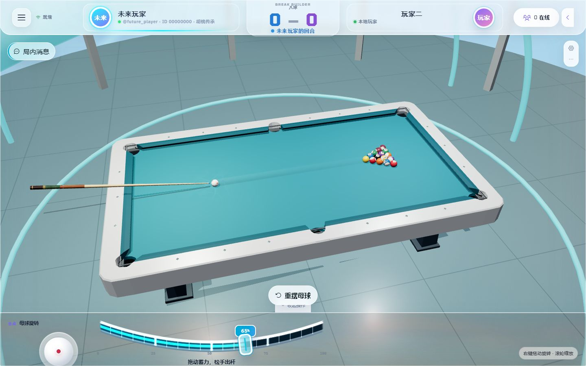
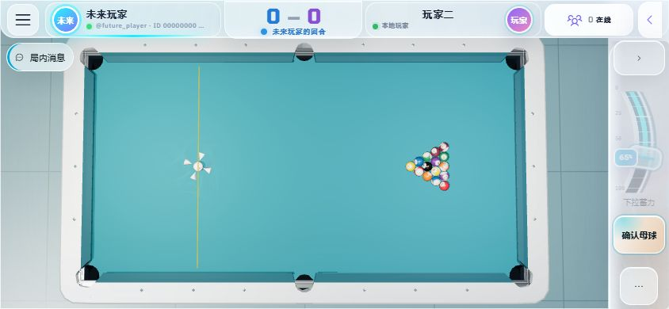
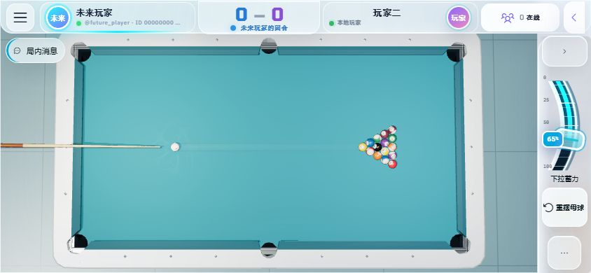
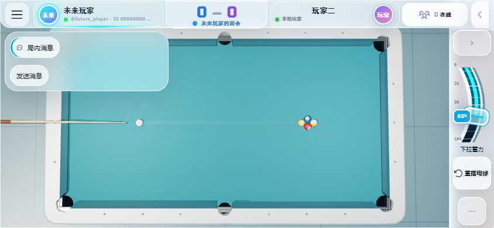

# Break Builder 截图问题修复与本地验收

日期：2026-09-05。此次修改保留工作区已有改动，没有部署或改动生产数据。

## 三张截图对应的问题

| 问题 | 查到的原因 | 本次处理与证据 |
| --- | --- | --- |
| 八球 7–7 却显示玩家赢 | AI 合法打进黑八后，终局仍比较进球数；平分时 `>=` 把玩家判为赢家 | 合法黑八/九球终局明确传递实际胜者；AI 黑八犯规明确判玩家胜。覆盖玩家进球数 7、12 和 AI 黑八同时落白球。终局保留规则原因，常规结算说明数字是进球统计。 |
| 四球只剩 9 号仍报首碰错误 | XY 紧凑状态恢复把袋中球标成桌上静止球，恢复停止流程也会复活袋中球；AI 独立规则对象还缺少母球引用 | 在稳定交接点按袋口位置恢复袋中状态和深度，停止运动保留落袋状态；AI 规则绑定实际母球。回归覆盖自由球交接后仅剩母球和 9 号、合法首碰/进袋、AI 对最后 9 号的判定。 |
| 横屏控件遮挡 | 聊天面板过大；摆球按钮使用页面固定定位；高画质玻璃特效与低画质产生不同的定位参照；力度文字换行、俯仰按钮压住旋转控件 | 聊天默认收起，展开限制 280px，触碰面板外自动关闭。确认母球进入右侧独立行，摆球阶段隐藏无效旋转控件；缩短力度提示，分开俯仰入口。高/低画质都验证按钮边界。 |

第一张截图本身不能完整还原最后一杆，但代码中的平分误判已经由回归用例确认。若玩家自己合法打进黑八，7–7 的进球统计也可以对应合法胜利，不能用进球统计替代黑八终局规则。

## 击球、模型与环境

- 修复物理滑块初始化覆盖球杆速度上限：此前浏览器读到 4.572 m/s，修复后为配置的 17 m/s。保留低力度精细控制，触屏松手采用最后位置，防止丢失末次移动/取消信号。
- 缩短出杆随挥动画至实际触球后的短暂阶段；AI 普通击球清除上一次抬杆角，候选策略正确识别碰撞双方中的实际母球。
- 球杆木纹、握把和缠线的凹凸高度改成符合场景米制尺寸的数值，调整皮头形状和阴影；非发光球杆不再每帧遍历更新能量材质。
- 象牙球桌底板重构为外围裙板，避免整块板封住六个袋口。袋内改为深色哑光；支撑、脚垫和裙板倒角，支撑位置及深色金属表面改善可见性。
- 台呢使用较深青色、细织纹和 mipmap；木框加入共享木纹，地面加入细微石材接缝。调整环境反射、主光与填充光、立柱落地高度及球体树脂粗糙度。
- 自由视角初始距离、角度重新取景，俯视视角留出桌边。顶部 HUD 增加浅色衬底，避免暗色环境中姓名和状态难以阅读。
- 胜利彩纸降低密度，末段淡出并在 8 秒清理，尊重减少动态效果设置，避免整张桌面永久堆满彩纸。
- 物理诊断保持逐步有限值检查，但完整快照按采样间隔生成，减少每步临时数组和向量分配。

## 验证结果

| 检查 | 结果 |
| --- | --- |
| 修改前 Jest 基线 | 113 suites / 793 tests 通过 |
| 最终 `corepack yarn test --runInBand` | 113 suites / 801 tests 通过 |
| `corepack yarn test:e2e e2e/responsive.spec.ts` | 10 tests 通过 |
| `corepack yarn lint` | TypeScript 与 ESLint 通过 |
| `corepack yarn stylelint dist/css/game-react.css` | 通过 |
| `corepack yarn prettify` | 完成；e2e 文件另外按同样风格格式化 |
| `corepack yarn dev` | webpack 构建通过 |

浏览器回归覆盖 844×390 高/低画质、915×412、960×432、1080×480 的关键动作；竖屏旋转提示；聊天边界与关闭；母球确认；两指视角；桌面设置；退出重新进入时只有一个物理循环。

浏览器实际拖动至约 98% 力度：16.659999847 m/s，正常散球，6398.4375 ms 模拟时间后结束；64 个采样帧，异常列表为空。此记录见 `full-power-shot.json`。自动化另外验证 100% 设置实际达到 17 m/s。

桌面高画质自由视角一次采样：125 draw calls、179314 triangles，DPR 1。此次没有真实手机帧率/温升数据，不把桌面渲染或代码改动描述为实体手机性能验收。

## 画面

桌面高画质：

横屏摆球与出杆：

聊天展开：

## 验收边界

本次是本地代码、构建和浏览器验收。线上 `play.campus3ai.xyz` 尚未部署本次改动；实体手机触感、持续游戏帧率与温升、生产联机往返仍需发布候选和真实设备验证。现有 glTF 仍有部分低多边形轮廓，本次没有声称所有资产已更换为新的高精模型。
